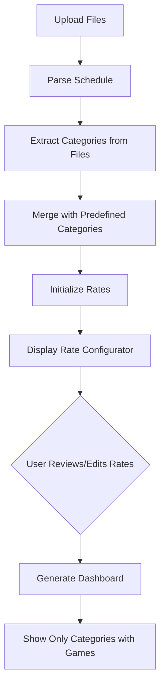

# Rate Configuration Enhancement Plan

## Overview
Enhance the rate configurator to always display all predefined category types with their default rates, ensuring users can see and modify rates for all standard categories regardless of whether they appear in uploaded files.

## Current State Analysis

### Existing Rate Logic (App.tsx lines 40-72)
The [`getDefaultRate()`](src/App.tsx:40) function defines default rates for:
- **Senior**: $40
- **Junior**: $30
- **Juvenil**: $28
- **Mini**: $25
- **Infantil**: $20
- **Femenino**: $28
- **U6-U8**: $25
- **U9-U11**: $27
- **U12-U14**: $29
- **U15-U16**: $30
- **U17-U19**: $35
- **U20+**: $40

### Current Behavior
1. Files are parsed and categories are extracted from the schedule
2. Only categories found in files are shown in [`RateConfig`](src/components/RateConfig.tsx:11)
3. Default rates are applied based on the [`getDefaultRate()`](src/App.tsx:40) logic
4. Users can only modify rates for categories that exist in their uploaded files

### Problem
Users cannot see or configure rates for predefined categories that don't appear in their current upload, making it difficult to:
- Set up a complete rate structure upfront
- Understand what categories are supported
- Prepare for future schedules with different categories

## Proposed Solution

### 1. Define Predefined Categories Constant
Create a constant array of all standard categories with their default rates:

```typescript
const PREDEFINED_CATEGORIES = [
  { name: 'Senior', rate: 40 },
  { name: 'Junior', rate: 30 },
  { name: 'Juvenil', rate: 28 },
  { name: 'Mini', rate: 25 },
  { name: 'Infantil', rate: 20 },
  { name: 'Femenino', rate: 28 },
  { name: 'U6-U8', rate: 25 },
  { name: 'U9-U11', rate: 27 },
  { name: 'U12-U14', rate: 29 },
  { name: 'U15-U16', rate: 30 },
  { name: 'U17-U19', rate: 35 },
  { name: 'U20+', rate: 40 }
];
```

### 2. Merge Categories Logic
In [`App.tsx`](src/App.tsx:1), modify the [`handleDateSubmit()`](src/App.tsx:94) function to:
1. Extract categories from uploaded files (as currently done)
2. Merge with predefined categories
3. Ensure predefined categories appear first, followed by any additional categories from files
4. Remove duplicates (file categories that match predefined ones)

### 3. Update RateConfig Component
Modify [`RateConfig.tsx`](src/components/RateConfig.tsx:1) to:
1. Display all categories (predefined + file-detected)
2. Group categories visually:
   - **Predefined Categories** section (always visible)
   - **Additional Categories** section (only if file contains categories not in predefined list)
3. Maintain existing functionality for rate editing

### 4. Dashboard Integration
Ensure [`Dashboard.tsx`](src/components/Dashboard.tsx:1) properly handles:
1. Categories with zero games (from predefined list)
2. Display only non-zero categories in the table OR show all with visual distinction
3. Export functionality includes all configured rates

## Implementation Details

### File Changes Required

#### 1. src/App.tsx
- Add `PREDEFINED_CATEGORIES` constant at the top of the file
- Create helper function `mergeCategoriesWithDefaults()` to combine predefined and detected categories
- Update [`handleDateSubmit()`](src/App.tsx:94) to use merged categories
- Ensure [`getDefaultRate()`](src/App.tsx:40) remains as fallback for any edge cases

#### 2. src/components/RateConfig.tsx
- Update component to accept and display all categories
- Add visual grouping (optional but recommended):
  - Section header for "Standard Categories"
  - Section header for "Additional Categories" (if any)
- Maintain existing rate editing functionality
- No changes needed to form submission logic

#### 3. src/components/Dashboard.tsx
- Consider filtering display to show only categories with games > 0
- OR show all categories but visually distinguish empty ones
- Ensure totals calculation works correctly with zero-game categories

## Category Sorting Strategy

Maintain existing sort order:
1. Predefined categories in logical order (Mini → Infantil → Juvenil → Junior → Femenino → Senior)
2. U-categories in numeric order (U6-U8 → U9-U11 → ... → U20+)
3. Additional file-detected categories at the end

## Edge Cases to Handle

1. **File category matches predefined but with different casing**: Normalize to predefined version
2. **File category is subset of predefined** (e.g., "Mini" vs "Mini Femenino"): Keep both, apply appropriate default rate
3. **Unknown categories in files**: Append to list with rate from [`getDefaultRate()`](src/App.tsx:40) or $0 if no match
4. **Empty file upload**: Show all predefined categories with default rates

## User Experience Flow



## Benefits

1. **Transparency**: Users see all supported category types upfront
2. **Consistency**: Standard rates are always visible and editable
3. **Flexibility**: Users can prepare rate structures before uploading files
4. **Completeness**: No category is hidden from configuration
5. **User Control**: Full visibility and control over all rate settings

## Testing Checklist

- [ ] All predefined categories appear in rate configurator
- [ ] Default rates are correctly applied to predefined categories
- [ ] File-detected categories are merged without duplicates
- [ ] Users can edit any category rate
- [ ] Dashboard displays correctly with mixed predefined/detected categories
- [ ] Export includes all configured categories
- [ ] Zero-game categories are handled appropriately in dashboard
- [ ] History feature preserves all category rates

## Notes

- The existing [`getDefaultRate()`](src/App.tsx:40) function should remain as it provides fallback logic for edge cases
- Consider adding a "Reset to Defaults" button in the rate configurator
- Future enhancement: Allow users to add custom categories manually
